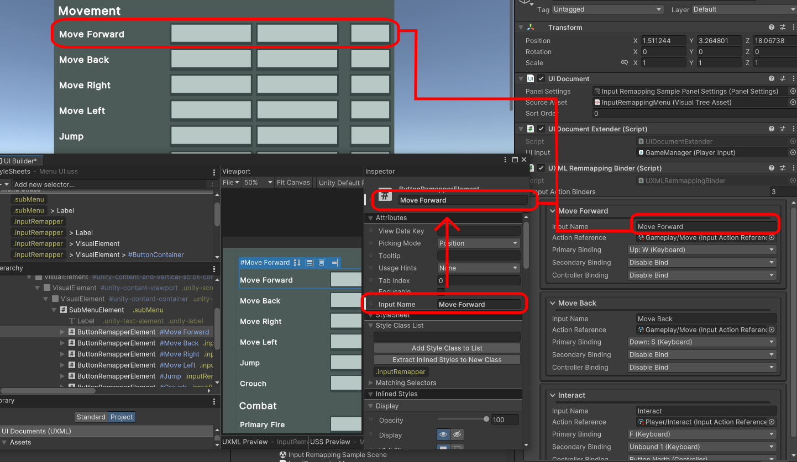

# Input Binding

There are two primary parts to this package subset. The first is runtime input rebinding via 
[**UIToolkit**](https://docs.unity3d.com/Manual/UIElements.html), the second is binding
input paths to textures to use as representative icons. These bindings occur through
unity's [**new input system**](https://docs.unity3d.com/Packages/com.unity.inputsystem@1.8/manual/index.html),
so any project that wants to make use of these features will need to utilise that system
for their inputs. To use this package its highly recommended that you have at least some intermediate knowledge 
of unity's [**UIToolkit**](https://docs.unity3d.com/Manual/UIElements.html) and 
[**InputSystem**](https://docs.unity3d.com/Packages/com.unity.inputsystem@1.8/manual/index.html) packages.

[**Input Remapping**](#input-remapping)\
[&emsp;> **1. Initial setup**](#initial-setup)\
[&emsp;> **2. UXML Assets**](#uxml-assets)\
[&emsp;&emsp;> **Create New Bindable UXML Assets**](#create-new-bindable-uxml-assets)\
[&emsp;&emsp;> **Using Existing UXML Assets**](#using-existing-uxml-assets)\
[&emsp;> **3. Using UXMLRemappingBinder**](#using-uxmlremappingbinder)\
[**Input Icon Binding**](#input-icon-binding)

# Input Remapping
 

## 1. Initial Setup

There are three major components to setting up input rebinding.
1. The [**UXML**](https://docs.unity3d.com/Manual/UIE-WritingUXMLTemplate.html) assets that will be loaded into the scene and act
as the runtime interface for input rebinding.
2. The [**InputActionAsset**](https://docs.unity3d.com/Packages/com.unity.inputsystem@0.9/manual/ActionAssets.html) you will
be using to store your input actions.
3. The [**UXMLRemappingBinder**](../InputBinding/Runtime/InputActionBinding/UIDocumentExtensions/UXMLRemmappingBinder.cs) MonoBehaviour,
which binds the UI to the actions and is essentially the brain of the rebinding.
 

If you would like to see an example on how to set up the input remapper along with these instructions, you can open a sample scene at;
 
[**Samples~/InputRemapingExample/Input Remapping Sample Scene.unity**](../Samples~/InputRemapingExample/)
 
 
 

## 2. UXML Assets
This package comes with its own set of UXML and USS under \
[/InputBinding/Assets/InputActionBinding/UIToolkit/](../InputBinding/Assets/InputActionBinding/UIToolkit/) \
The most relevant of these being [**InputRemapper**](../InputBinding/Assets/InputActionBinding/UIToolkit/VisualTreeAssets/InputRemapper.uxml),
which has all the elements to be used for a single action binding. There are also UXML elements for the singular buttons,
[**ButtonWithIcon**](../InputBinding/Assets/InputActionBinding/UIToolkit/VisualTreeAssets/InputRemapper.uxml),
used in [**InputRemapper**](../InputBinding/Assets/InputActionBinding/UIToolkit/VisualTreeAssets/InputRemapper.uxml).
Additionally, container element [**SubMenu**](../InputBinding/Assets/InputActionBinding/UIToolkit/VisualTreeAssets/SubMenu.uxml) can be
used for easily setting up menus with a header.

If you want to create
your own UXML asset compatable with [**UXMLRemappingBinder**](../InputBinding/Runtime/InputActionBinding/UIDocumentExtensions/UXMLRemmappingBinder.cs),
you can follow the instructions [here](#create-new-bindable-uxml-assets). Otherwise, if you want
to learn how to use and modify the included UXML assets provided, you can find that [here](#using-existing-uxml-assets)

 

### Create New Bindable UXML Assets
 

This accompanied graph shows the hierarchy of Visual elements that is required for the
[**UXMLRemappingBinder**](../InputBinding/Runtime/InputActionBinding/UIDocumentExtensions/UXMLRemmappingBinder.cs) to find all of the elements for the UI 
to be properly bound.

To create a **single input action rebinder** with the three rebindable binding paths, you will need a container
VisualElement that has a unique **name** (Shown as #EXAMPLENAME),
which is used by the [**UXMLRemappingBinder**](../InputBinding/Runtime/InputActionBinding/UIDocumentExtensions/UXMLRemmappingBinder.cs)
to link its sub-buttons to a specific action. This element then needs to contain three children elements with the
names, **KeyboardPrimary**, **KeyboardSecondary**, **ControllerMapping**. Each of these need to have a 
[**Button**](https://docs.unity3d.com/Manual/UIE-uxml-element-Button.html) as their **first child**.
Then finally, **all three** of these buttons need to have VisualElement children with the names **Icon** and
**ButtonOverlay**. These elements are used for the icon of the currently chosen input binding,
and an overlay for when the button is disabled, respectively.

The final UXML asset used for the asset rebinding, it is recommended to include an overlay element to give feedback to the binding and allows
the display of relevant information, as well as stopping the player from interacting with anything else while the binding is taking place.
To do this, Implement a VisualElement with the name **BindingOverlay**, and give it two children **Labels**, called **TopLabel** and **BottomLabel**.

&nbsp;
 
 

You will also need to create a new [**USS**](https://docs.unity3d.com/Manual/UIE-about-uss.html)
asset attached to these [**UXML**](https://docs.unity3d.com/Manual/UIE-WritingUXMLTemplate.html) assets with the following
[**USS classes**](https://docs.unity3d.com/Manual/UIE-USS-Selectors-class.html):

1. **.hidden** \
    This is added/removed from **BindingOverlay** when a rebinding begins/ends. In the sample scene this sets the
    [**display to none**](https://docs.unity3d.com/Manual/UIE-USS-SupportedProperties.html#:~:text=display%3A%20flex%20%7C%20none)

2. **.disabled** \
    This is added/removed from the rebinding [**Buttons**](https://docs.unity3d.com/Manual/UIE-uxml-element-Button.html)
    when they have been disabled in the inspector. In the sample scene this
    [**displays**](https://docs.unity3d.com/Manual/UIE-USS-SupportedProperties.html#:~:text=display%3A%20flex%20%7C%20none)
    the button's **ButtonOverlay** child with a striped texture

2. **.greyedOut** \
    This is added/removed from the rebinding [**Buttons**](https://docs.unity3d.com/Manual/UIE-uxml-element-Button.html)
    when they can't/can be used based on the current control method. In the sample scene this
    [**displays**](https://docs.unity3d.com/Manual/UIE-USS-SupportedProperties.html#:~:text=display%3A%20flex%20%7C%20none)
    the button's **ButtonOverlay**, and makes it grey and semi-transparent
 
 

**Using Custom Controls**

If you are using a [**custom control**](https://docs.unity3d.com/Manual/UIE-custom-controls.html) element that loads a UXML
asset inside of itself, it is highly recommended to load it through the UILoader inside this package. Further information on how to use
that sub-package can be found here.

 

### Using Existing UXML Assets

[**InputRemapper**](../InputBinding/Assets/InputActionBinding/UIToolkit/VisualTreeAssets/InputRemapper.uxml) Hierachy

If you want to take advantage of the existing [**UXML controls**](https://docs.unity3d.com/Manual/UIE-custom-controls.html)
and assets, the best way to do it is to create a custom [**USS**](https://docs.unity3d.com/Manual/UIE-about-uss.html)
asset to decorate them. The [**InputRemapper control**](../InputBinding/Runtime/InputActionBinding/VisualElements/ButtonRemapperElement.cs)
can be imported into a UXML document, and a USS asset can be added into that container document, overriding the existing
styles. An example of this can be found below. Additionally if you are using the
[**InputRemapper control**](../InputBinding/Runtime/InputActionBinding/VisualElements/ButtonRemapperElement.cs), you can modify the **input name**
variable to change the name of the control, and the text of the label.

 
 
 

## 3. Using [**UXMLRemappingBinder**](../InputBinding/Runtime/InputActionBinding/UIDocumentExtensions/UXMLRemmappingBinder.cs)

[**UXMLRemappingBinder**](../InputBinding/Runtime/InputActionBinding/UIDocumentExtensions/UXMLRemmappingBinder.cs) is the monobehaviour that
binds the UI its rebinding functionality, as well as having several other utility functions. In order to add this behaviour
to a Gameobject, you first need to add a [**UIDocument**](https://docs.unity3d.com/ScriptReference/UIElements.UIDocument.html),
then a **UIDocumentExtender**, a behaviour added to this package. More information about using the **UIDocumentExtender**
can be found here.

Binding remapping UI to an action is fairly simple. Each remapper is added as a single element in the Input Action Binders array,
which references an input name, action reference, and three bindings of the selected action. If the **input name** matches the
**name** of any element inside the UIDocument's loaded UXML asset, they will be bound.

 

<!---->

<!--

-->

# Input Icon Binding

