# Input Binding

**In order to use this package you will need to have UI Tookit Utility installed**

There are two primary parts to this package. The first is runtime input rebinding via [**UIToolkit**](https://docs.unity3d.com/Manual/UIElements.html), the second is binding input paths to textures to use as representative icons. These bindings occur through unity's [**new input system**](https://docs.unity3d.com/Packages/com.unity.inputsystem@1.8/manual/index.html), so any project that wants to make use of these features will need to utilise that system for their inputs. To use this package its highly recommended that you have at least some intermediate knowledge of unity's [**UIToolkit**](https://docs.unity3d.com/Manual/UIElements.html) and [**InputSystem**](https://docs.unity3d.com/Packages/com.unity.inputsystem@1.8/manual/index.html) packages.

[**Input Remapping**](#input-remapping)\
[&emsp;> **1. Initial setup**](#initial-setup)\
[&emsp;> **2. UXML Assets**](#uxml-assets)\
[&emsp;&emsp;> **Create New Bindable UXML Assets**](#create-new-bindable-uxml-assets)\
[&emsp;&emsp;> **Using Existing UXML Assets**](#using-existing-uxml-assets)\
[&emsp;> **3. Using UXMLRemappingBinder**](#using-uxmlremappingbinder)\
[**Input Icon Binding**](#input-icon-binding)\
[&emsp;> **1. Creating The Button Icon Bindings Object**](#creating-the-button-icon-bindings-object)\
[&emsp;> **2. Binding Icons To Textures**](#binding-icons-to-textures)\
[&emsp;&emsp;> **Binding Set**](#binding-set)\
[&emsp;&emsp;> **Icon Bind**](#icon-bind)\
[&emsp;&emsp;> **Creating An Animatable Texture**](#creating-an-animatable-texture)\
[&emsp;> **3. Getting Input Icons From Icon Binds**](#getting-input-icons-from-icon-binds)\
[&emsp;&emsp;> **InputBindingIconElement**](#inputbindingiconelement)\
[&emsp;&emsp;> **InputBindingTextWithIconsElement**](#inputbindingtextwithiconselement)\
[&emsp;&emsp;> **Access Icon Binds Directly In Script**](#access-icon-binds-directly-in-script)


# Input Remapping
<br>

## 1. Initial Setup


There are three major components to setting up input rebinding.
1. The [**UXML**](https://docs.unity3d.com/Manual/UIE-WritingUXMLTemplate.html) assets that will be loaded into the scene and act as the runtime interface for input rebinding.
2. The [**InputActionAsset**](https://docs.unity3d.com/Packages/com.unity.inputsystem@0.9/manual/ActionAssets.html) you will be using to store your input actions.
3. The [**UXMLRemappingBinder**](../Runtime/InputActionBinding/UIDocumentExtensions/UXMLRemmappingBinder.cs) MonoBehaviour, which binds the UI to the actions and is essentially the brain of the rebinding.
<br>

If you would like to see an example on how to set up the input remapper along with these instructions, you can open a sample scene at;
<br>
[**Samples~/InputRemapingExample/Input Remapping Sample Scene.unity**](../Samples~/InputRemapingExample/)
<br>
<br>
<br>


## 2. UXML Assets
This package comes with its own set of UXML and USS under \
[/InputBinding/Assets/InputActionBinding/UIToolkit/](../Assets/InputActionBinding/UIToolkit/) \
The most relevant of these being [**InputRemapper**](../Assets/InputActionBinding/UIToolkit/VisualTreeAssets/InputRemapper.uxml), which has all the elements to be used for a single action binding. There are also UXML elements for the singular buttons, [**ButtonWithIcon**](../Assets/InputActionBinding/UIToolkit/VisualTreeAssets/InputRemapper.uxml), used in [**InputRemapper**](../Assets/InputActionBinding/UIToolkit/VisualTreeAssets/InputRemapper.uxml). Additionally, container element [**SubMenu**](../Assets/InputActionBinding/UIToolkit/VisualTreeAssets/SubMenu.uxml) can be used for easily setting up menus with a header.

If you want to create your own UXML asset compatable with [**UXMLRemappingBinder**](../Runtime/InputActionBinding/UIDocumentExtensions/UXMLRemmappingBinder.cs), you can follow the instructions [here](#create-new-bindable-uxml-assets). Otherwise, if you want to learn how to use and modify the included UXML assets provided, you can find that [here](#using-existing-uxml-assets)

<br>

### Create New Bindable UXML Assets
<br>

<div style="float: left;width: 100%;">
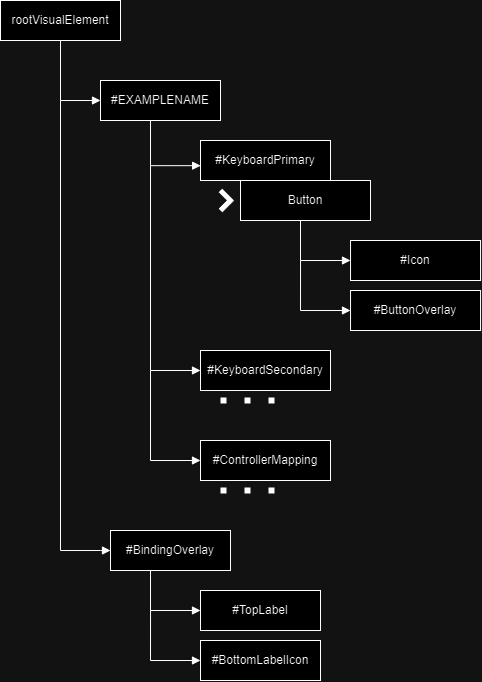

This accompanied graph shows the hierarchy of Visual elements that is required for the [**UXMLRemappingBinder**](../Runtime/InputActionBinding/UIDocumentExtensions/UXMLRemmappingBinder.cs) to find all of the elements for the UI to be properly bound.

To create a **single input action rebinder** with the three rebindable binding paths, you will need a container VisualElement that has a unique **name** (Shown as #EXAMPLENAME), which is used by the [**UXMLRemappingBinder**](../Runtime/InputActionBinding/UIDocumentExtensions/UXMLRemmappingBinder.cs) to link its sub-buttons to a specific action. This element then needs to contain three children elements with the names, **KeyboardPrimary**, **KeyboardSecondary**, **ControllerMapping**. Each of these need to have a [**Button**](https://docs.unity3d.com/Manual/UIE-uxml-element-Button.html) as their **first child**. Then finally, **all three** of these buttons need to have a VisualElement child with the name **ButtonOverlay**, and an [**InputBindingIconElement**](../Runtime/InputIconBinding/VisualElements/InputBindingIconElement.cs) with the name **Icon**. These elements are used for the icon of the currently chosen input binding, and an overlay for when the button is disabled, respectively. More on how to add an [**InputBindingIconElement**](../Runtime/InputIconBinding/VisualElements/InputBindingIconElement.cs) can be found here.

The final UXML asset used for the asset rebinding, it is recommended to include an overlay element to give feedback to the binding and allows the display of relevant information, as well as stopping the player from interacting with anything else while the binding is taking place. To do this, Implement a VisualElement with the name **BindingOverlay**, and give it a child **Label** called **TopLabel**, and an [**InputBindingIconElement**](../Runtime/InputIconBinding/VisualElements/InputBindingIconElement.cs) called **BottomLabelIcon**.

</div>
&nbsp;
<br>
<br>

You will also need to create a new [**USS**](https://docs.unity3d.com/Manual/UIE-about-uss.html) asset attached to these [**UXML**](https://docs.unity3d.com/Manual/UIE-WritingUXMLTemplate.html) assets with the following [**USS classes**](https://docs.unity3d.com/Manual/UIE-USS-Selectors-class.html):

1. **.hidden** \
    This is added/removed from **BindingOverlay** when a rebinding begins/ends. In the sample scene this sets the [**display to none**](https://docs.unity3d.com/Manual/UIE-USS-SupportedProperties.html#:~:text=display%3A%20flex%20%7C%20none)

2. **.disabled** \
    This is added/removed from the rebinding [**Buttons**](https://docs.unity3d.com/Manual/UIE-uxml-element-Button.html) when they have been disabled in the inspector. In the sample scene this [**displays**](https://docs.unity3d.com/Manual/UIE-USS-SupportedProperties.html#:~:text=display%3A%20flex%20%7C%20none) the button's **ButtonOverlay** child with a striped texture

2. **.greyedOut** \
    This is added/removed from the rebinding [**Buttons**](https://docs.unity3d.com/Manual/UIE-uxml-element-Button.html) when they can't/can be used based on the current control method. In the sample scene this [**displays**](https://docs.unity3d.com/Manual/UIE-USS-SupportedProperties.html#:~:text=display%3A%20flex%20%7C%20none) the button's **ButtonOverlay**, and makes it grey and semi-transparent
<br>
<br>

**Using Custom Controls**

If you are using a [**custom control**](https://docs.unity3d.com/Manual/UIE-custom-controls.html) element that loads a UXML asset inside of itself, it is highly recommended to load it through the UILoader inside this package. Further information on how to use that sub-package can be found here.

<br>

### Using Existing UXML Assets

[**InputRemapper**](../Assets/InputActionBinding/UIToolkit/VisualTreeAssets/InputRemapper.uxml) Hierachy
<div>
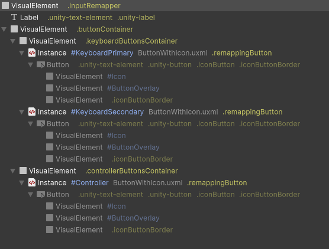
</div>

<div style="float: left">
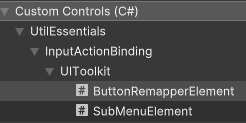

If you want to take advantage of the existing [**UXML controls**](https://docs.unity3d.com/Manual/UIE-custom-controls.html) and assets, the best way to do it is to create a custom [**USS**](https://docs.unity3d.com/Manual/UIE-about-uss.html) asset to decorate them. The [**InputRemapper control**](../Runtime/InputActionBinding/VisualElements/ButtonRemapperElement.cs) can be imported into a UXML document, and a USS asset can be added into that container document, overriding the existing styles. An example of this can be found below. Additionally if you are using the [**InputRemapper control**](../Runtime/InputActionBinding/VisualElements/ButtonRemapperElement.cs), you can modify the **input name** variable to change the name of the control, and the text of the label.
</div>

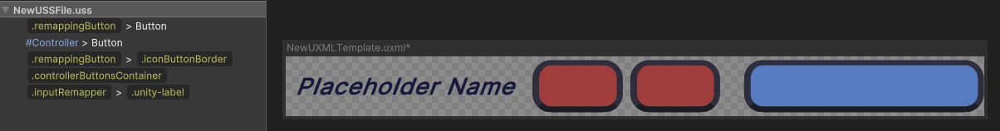

<br>
<br>
<br>

## 3. Using [**UXMLRemappingBinder**](../Runtime/InputActionBinding/UIDocumentExtensions/UXMLRemmappingBinder.cs)

<div style="float: left; width: 100%">

[**UXMLRemappingBinder**](../Runtime/InputActionBinding/UIDocumentExtensions/UXMLRemmappingBinder.cs) is the monobehaviour that binds the UI its rebinding functionality, as well as having several other utility functions. In order to add this behaviour to a Gameobject, you first need to add a [**UIDocument**](https://docs.unity3d.com/ScriptReference/UIElements.UIDocument.html), then a **UIDocumentExtender**, a behaviour added in the **UIToolkit Utility** package. More information about using the **UIDocumentExtender** within the documentation of that project.

Binding remapping UI to an action is fairly simple. Each remapper is added as a single element in the Input Action Binders array, which references an input name, action reference, and three bindings of the selected action. If the **input name** matches the **name** of any element inside the UIDocument's loaded UXML asset, they will be bound.

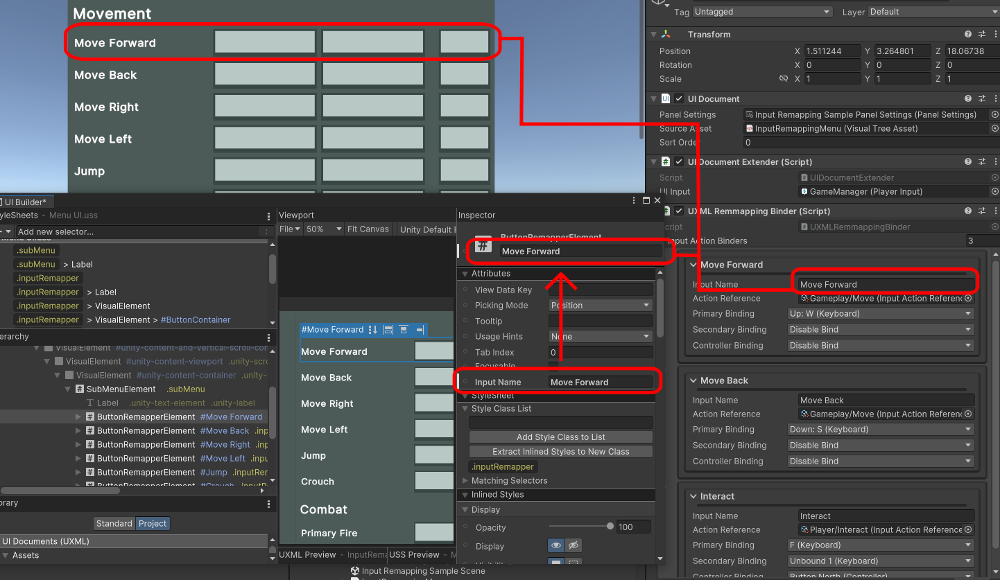
</div>
<br>

# Input Icon Binding

The icon binding sub-package lets you bind a texture to an input path. These bindings are set up in a [**SOButtonIconBindings**](../Runtime/InputIconBinding/SOButtonIconBindings.cs), and can be accessed directly through the singleton class [**ButtonIconBindingsEditorSettings**](../Runtime/InputIconBinding/ButtonIconBindingsEditorSettings.cs). There are also utility [**UXML controls**](https://docs.unity3d.com/Manual/UIE-custom-controls.html), [**InputBindingIconElement**](../Runtime/InputIconBinding/VisualElements/InputBindingIconElement.cs) and [**InputBindingTextWithIconsElement**](../Runtime/InputIconBinding/VisualElements/InputBindingIconElement.cs), which allow you to utilise the texture bindings without scripting.

## 1. Creating The Button Icon Bindings Object

<div>
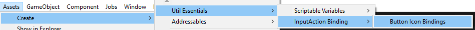

To set up the texture bindings, you will first need to create a [**SOButtonIconBindings**](../Runtime/InputIconBinding/SOButtonIconBindings.cs) to hold them. The path to create this [**ScriptableObject**](https://docs.unity3d.com/Manual/class-ScriptableObject.html) instance is to open the **Assets** tab at the top of the editor, then navigate through **Create > Util Essentials > InputAction Binding > Button Icon Bindings**.
</div>

<div style="padding-top: 10px">
<div style="float: left;width: 100%">

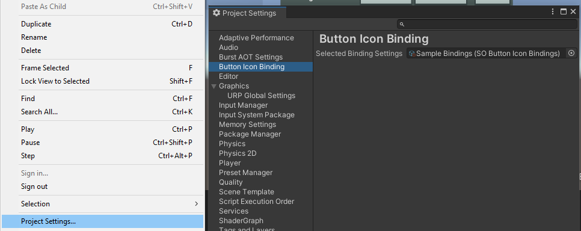
</div>

Once you have created the asset, you will need to link it up in the **Project Settings**, you can do this by navigating through **Edit > Project Settings > Button Icon Binding**, and then selecting the newly created **SOButtonIconBindings** in the **Selected Binding Settings Field**. A **SOButtonIconBindings** can only be referenced and used if it is the one set in this field.
</div>

## 2. Binding Icons To Textures

Opening a **SOButtonIconBindings** asset, such as the one created in the previous step, in the project window will open a new window called **Button Icon Bindings**. 


<div style="float: left; width: 100%">
<div style="float: left;width: 500px;margin-right: 10px;">

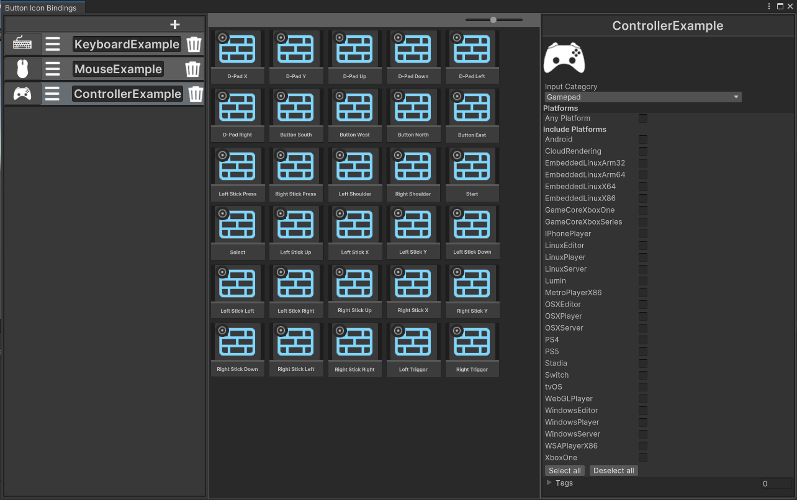

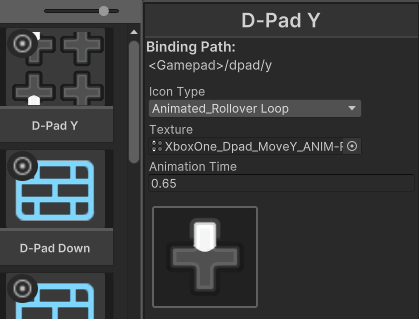
</div>

The first thing you will need to create is a new **Binding Set** by pressing the **plus** icon on the left most container. If you have multiple bind sets, you can use the **garbage bind icon** on a **Binding Set** to delete it, and drag the **hamburger icon** to move it. Through the **Binding Set**, you can access all of the bindings of a chosens **input category**. The **input category** can be changed through clicking on the icon on the right of the **Binding Set**, or through the rightmost menu when the **Binding Set** is **selected**. More info on the other fields in **Binding Sets** can be found below.
<br>
<br>

### Binding Set

**Icon Bind/s**: Contains an icon binding for each input in a chosen input category.

**Input Category**: The category of inputs that this set will bind, e.g. Gamepad, Keyboard, Mouse.

**NameID**: The name of this set that can be used in searches, recommended to be unique.

**Platforms**: What platforms this set will be able to be used in.

**Tags**: What tags this set will have for searching purposes.
<br>
<br>

Clicking on an **Binding Set** will display all of its contained **Icon Binds** inside the center container. Clicking on any of these will open the menu for that **Input Bind** on the rightmost division. Inside this menu it contains the **binding path** of the input being bound, and addition options for the icon, found below.
<br>
<br>

### Icon Bind

**Icon Type**: The type of icon it is, being static or some variant of animated.

**Texture**: The full texture of the icon, if you're trying to bind a texture to an animated icon, instructions can be found here.

**Animation Time**: Only is displayed when the **Icon Type** is animated, is the amount of time it takes for the animation to loop/ rollover.
<br>
<br>

### Creating An Animatable Texture

In order to create a texture that can be animated, you will need to have Unity's [**2D Sprite Package**](https://docs.unity3d.com/Packages/com.unity.2d.sprite@1.0/manual/index.html) installed. Using the [**Sprite Editor**](https://docs.unity3d.com/6000.0/Documentation/Manual/sprite-editor-use.html) in that package, you will need to split a texture **sprite sheet** into sprites, and then use that texture as the texture in the animated **Icon Bind**. The **Icon Bind** will automatically find and use each of the cut sprites created in the [**Sprite Editor**](https://docs.unity3d.com/6000.0/Documentation/Manual/sprite-editor-use.html) and use them as frames in the animation.

</div>

<br>
<br>

## 3. Getting Input Icons From Icon Binds
<div style="width: 100%;float: left;">

### InputBindingIconElement

<div style="float: left; width: 320px;">
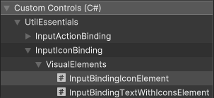
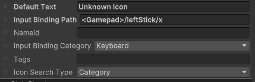
</div>

The easiest way to implement icon bindings is to use the [**InputBindingIconElement**](../Runtime/InputIconBinding/VisualElements/InputBindingIconElement.cs) [**UXML control**](https://docs.unity3d.com/Manual/UIE-custom-controls.html), which can be found at \
**UtilEssentials > InputActionBinding > UIToolkit > ButtonRemapperElement**.\
This will automatically bind its background image to an icon, found using an **Input Binding Path**. You can input all of the searching parameters defined in the [**Binding Set**](###binding-set) (Input Category, NameID, Tags), and then decide which of those you actually want to use through the **Icon Search Type parameter**. Additionally, there is a parameter called **Default Text**, which is the text that is displayed when an icon texture cannot be found.

</div>

<div style="width: 100%;float: left;margin-top: 20px">

### InputBindingTextWithIconsElement

<div style="width: 100%;float: left;">
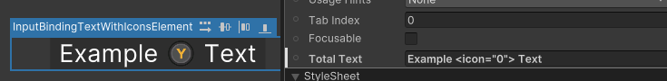
</div>

If you want to use an icon in the middle of text, you can use an [**InputBindingTextWithIconsElement**](../Runtime/InputIconBinding/VisualElements/InputBindingTextWithIconsElement.cs)[**UXML control**](https://docs.unity3d.com/Manual/UIE-custom-controls.html), which can be found at \
**UtilEssentials > InputActionBinding > UIToolkit > InputBindingTextWithIconsElement**.\
 If you add an **InputBindingIconElement** as a child element to this element, you can then can insert that icon element into a specific place in the text parameter **Total Text** using the inline tag **<icon="x">**, x being the child index of the **InputBindingIconElement** (Only including other **InputBindingIconElements**)

 ### Access Icon Binds Directly In Script

 There are two different ways to access an Icon from a binding using a set of search parameters, both **Static Functions** coming from the **ButtonIconBindingsEditorSettings** class. \
 The first is **ButtonIconBindingsEditorSettings.BindVisualElementImageToIconBinding()**, which takes a **VisualElement** and binds it directly to the found icon, including animating it. \
 The second is **ButtonIconBindingsEditorSettings.GetIconTextureFromBindingPath()**, which returns the a found texture matching the input search parameters. It is highly recommended not to use this second function for binding animated icons, since it will return the entire spritesheet.

 The sourcecode for each function can be found [**here**](../Runtime/InputIconBinding/ButtonIconBindingsEditorSettings.cs), with an additional description of the **ButtonIconBindingsEditorSettings.BindVisualElementImageToIconBinding()** function found below.


```c#
// The VisualElement for this icon to be bound to
VisualElement ve;

// An action delegate you can use to cancel the icon animation if there is one
Action cancelAnimationDelegate;

// The binding path that you are trying to bind
string bindingPath;

// Attempts to bind the first IconBindsContainer with this nameID
string nameID;

// Attempts to bind the first IconBindsContainer with this category
InputBindingCategories category;

// Attempts to bind the first IconBindsContainer with these tags
string[] tags;

// Enum which decides which of the input parameters to actually use for searching
InputBindingSearchType searchType;

// Returns true/false depending on whether the bind was successful
ButtonIconBindingsEditorSettings.BindVisualElementImageToIconBinding(ve, out cancelAnimationDelegate, bindingPath, nameID, bindingCategory, tags, searchType);

```


 </div>